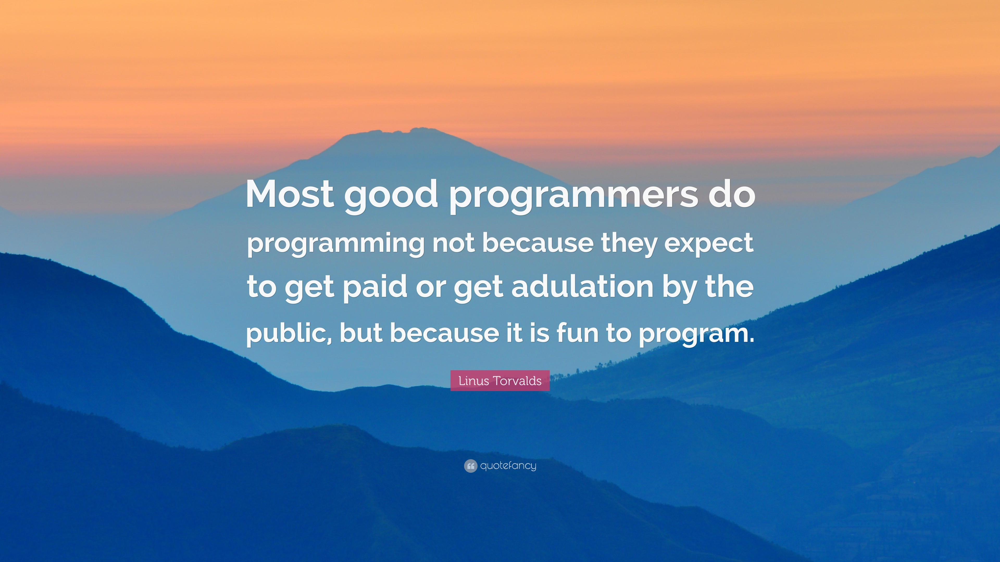

## Hi there 👋

### About me
My name is Layne Liu. I am a recent master's graduate in computing science at [Utrecht University](https://www.uu.nl/en). 
Before this, I received my bachelor's degree from [University of Electronic Science and Technology of China](https://en.uestc.edu.cn/),
and then I worked as a cloud engineer at [China Pacific Insurance Company](https://www.cpic.com.cn/) for almost two years.

### My favorite programming languages
I prefer three languages ---- C++, Python and Haskell.
- C++ forces me to think what really programming languages are.
- Python is concise and easy to express my ideas clearly.
- Haskell, which is a pure functional language, gives me lots of new experiences. 

### My quotes

